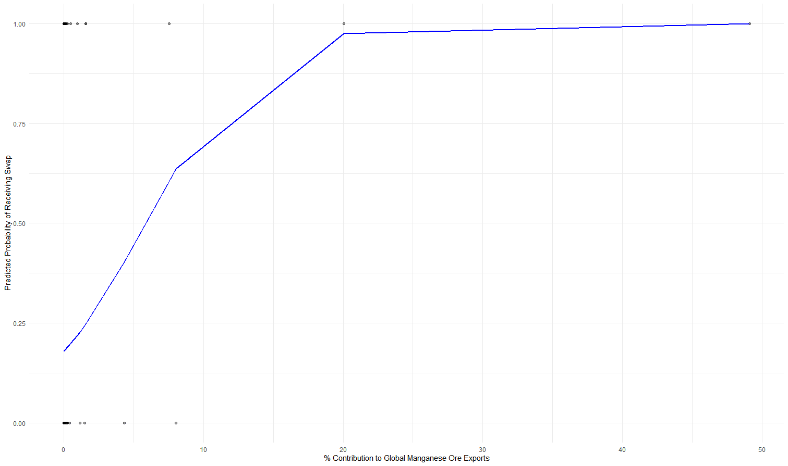
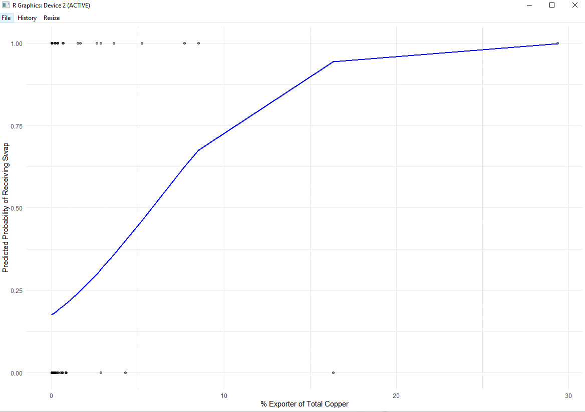

## Goal
Scrapped detailed dataset relating to independent variables of raw material exports by country, strategic electrical exports by country, and several control variables around GDP Per Capita (in current USD),Max Inflation Rate (as %),Min Government Net Lending - Borrowing Ratio (% of GDP),Total Exports to China (as % of China's total imports),Total Imports from China (as % of China's total exports), Geographic proximity to China (in miles), and Population Size (in millions), 

The goal is to run a multivariable logistical regression model against the data provided to assess the correlation between the probability of receiving a currency swap from China against the above factors. Ideally we want to use this regression analysis to answer the below 2 questions:
1. What is the probability of a country receiving a swap if they export at least 5% of any critical green input globally?
2. What is the probability of a country receiving a swap given how much of a critical green export they buy from China?

## Analysis
We've implemented this using [SkLearn's Random Forest Classifier](https://scikit-learn.org/stable/modules/generated/sklearn.ensemble.RandomForestClassifier.html) function. 

We've chosen the this classifier as it performed best in our testing over multiple inputs.

For the control dataset, we're missing data for Virgin Islands, Turks and Caicos, Saint Martin, Northern Mariana Islands, Democratic People's republic of Korea, Isle of Man, Guam, Greenland, Gibralter, French Polynesia, Faroe Islands, Curacao, Channel Islands, Cayman Islands, British Virgin Islands, Bermuda, and American Samoa. Meaning our dataset should incorporate only 182 countries

Annabel's initial analysis isolated individual, independent variables and ran a single variable logistical analysis against the below 2 minerals. 

Manganese Ore:

Copper Ore:

## Evaluation
We will evaluate the model with some standard linear regression metrics which are built into the sklearn library
- [Accuracy](https://scikit-learn.org/stable/modules/generated/sklearn.metrics.accuracy_score.html#sklearn.metrics.accuracy_score) = The set of labels (both 0 and 1) predicted correctly
- [Precision](https://scikit-learn.org/stable/modules/generated/sklearn.metrics.precision_score.html#sklearn.metrics.precision_score) = The precision is the ratio tp / (tp + fp) where tp is the number of true positives and fp the number of false positives. The precision is intuitively the ability of the classifier not to label as positive a sample that is negative.
  - This is likely the most important metric because there can be a multitude of reasons that a country receives a currency swap that might not be reflected in the model. So we care most that our model is accurately predicting counties which receive a swap even if it misses countries who received a swap for a reason not reflected in our data.  
- [Recall](https://scikit-learn.org/stable/modules/generated/sklearn.metrics.recall_score.html#sklearn.metrics.recall_score) = The recall is the ratio tp / (tp + fn) where tp is the number of true positives and fn the number of false negatives. The recall is intuitively the ability of the classifier to find all the positive samples.
- [F1-score](https://scikit-learn.org/stable/modules/generated/sklearn.metrics.f1_score.html#sklearn.metrics.f1_score) = The F1 score can be interpreted as a harmonic mean of the precision and recall, where an F1 score reaches its best value at 1 and worst score at 0. The relative contribution of precision and recall to the F1 score are equal. The formula for the F1 score is: `F1 = 2 * (precision * recall) / (precision + recall)`

## Other notes:
- Removed commas from country names to allow CSV file to work